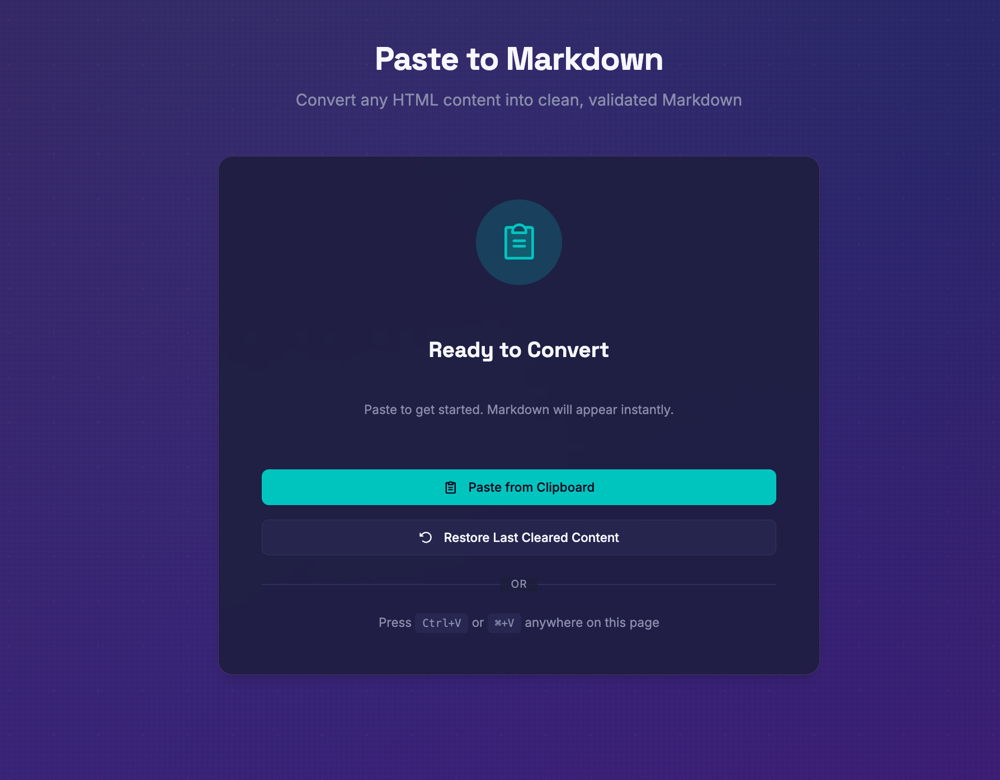
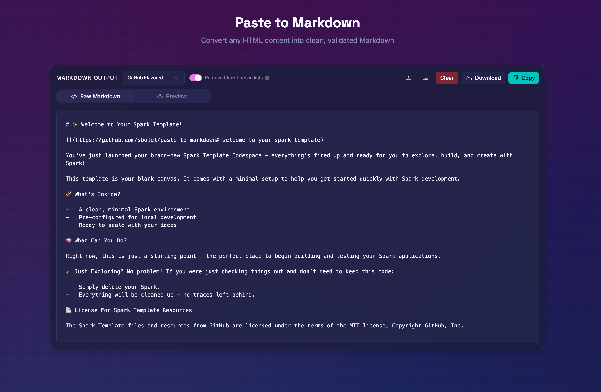

# Paste to Markdown

Paste to Markdown is a browser-based HTML-to-Markdown converter built by [Sinan Bolel](https://sinanbolel.com/) ([`sbolel`](https://github.com/sbolel)). It converts rich clipboard HTML into clean Markdown locally in the browser and is organized as a pnpm workspace with a reusable core package.

**Live demo:** [sbolel.github.io/paste-to-markdown](https://sbolel.github.io/paste-to-markdown/)
**About the project:** [sbolel.github.io/paste-to-markdown/about](https://sbolel.github.io/paste-to-markdown/about/)

| Ready to convert                                                          | Markdown output                                                       |
| ------------------------------------------------------------------------- | --------------------------------------------------------------------- |
|  |  |

## What It Does

- Pastes rich HTML from documents, email, webpages, and editors.
- Converts content to Markdown locally in the browser.
- Lets you edit the raw Markdown and inspect a sanitized rendered preview.
- Lets you copy Markdown to the clipboard or download it as a Markdown file.
- Lets you clear and restore the current document during the browser session.
- Offers GitHub Flavored Markdown, CommonMark, Strict Markdown, and Custom Style presets, including supported GitHub-style tables.

## Privacy

Paste to Markdown runs conversion in your browser. Pasted content is not sent to an app server. The current document is held only for the browser session so it can be restored after clearing; only formatting preferences are stored in the browser.

## Workspace Structure

```
paste-to-markdown/
├── apps/
│   └── web/              # Maintained application (React + Vite + TypeScript)
└── packages/
    └── core/             # Shared conversion logic (@paste-to-markdown/core)
```

## Getting Started

The checked-in `.nvmrc` selects Node 24; workspace tooling requires Node 24.15 or newer. With `nvm`, run `nvm use`, then install and start the workspace:

```bash
nvm use
pnpm install
pnpm dev
```

Open [http://localhost:5173/paste-to-markdown/](http://localhost:5173/paste-to-markdown/) in your browser.

Before running production browser checks for the first time, install their browsers:

```bash
pnpm --filter @paste-to-markdown/web exec playwright install chromium webkit
```

On Linux, add `--with-deps` to install the browsers' system dependencies, as CI does.

## Scripts

| Command           | Description                                                                |
| ----------------- | -------------------------------------------------------------------------- |
| `pnpm dev`        | Start the website application                                              |
| `pnpm build`      | Build the core package and web app, then validate the Pages artifact       |
| `pnpm test`       | Run core and web unit tests                                                |
| `pnpm test:e2e`   | Test the built web artifact in Chromium and WebKit; run `pnpm build` first |
| `pnpm lint`       | Lint TypeScript files                                                      |
| `pnpm typecheck`  | Type-check all packages                                                    |
| `pnpm format`     | Format source and documentation files                                      |
| `pnpm check`      | Run lint, type checks, unit tests, build, and production browser tests     |
| `pnpm audit:prod` | Audit production dependencies                                              |

## Packages

### `@paste-to-markdown/core`

The shared runtime-agnostic conversion package provides `convertHtmlToMarkdown(html, options?)` and `convertClipboardData(clipboardData, options?)`.

See the [core package's runtime compatibility policy](packages/core/README.md#runtime-compatibility) for the distinction between standalone consumers and workspace tooling.

### `apps/web`

The React, Tailwind, Vite, and TypeScript website is the sole maintained application and GitHub Pages build. It consumes `@paste-to-markdown/core` for conversion while handling browser UI interactions, paste events, editable Markdown, sanitized preview, downloads, session-only restore, and formatting preferences. Fonts are bundled locally, with their licenses in `public/font-licenses/`.

This private package uses the workspace's Node.js `>=24.15.0` requirement for development and build tooling. The deployed application runs in the browser.

The historical root implementation in `src/` remains outside the build as a reference. Make application changes in `apps/web`; the root implementation is not maintained.

## Architecture Notes

- **`packages/core`** is runtime-agnostic: no DOM or browser UI concerns.
- **`apps/web`** handles all UI interactions.
- HTML-to-Markdown conversion uses [Turndown](https://github.com/mixmark-io/turndown) with four shared Markdown presets. GitHub mode supports strikethrough, task-list markers, and simple GFM tables. See [conversion behavior and fallbacks](packages/core/README.md#conversion-behavior) for complex tables, code, whitespace, and nonportable references.

## Release

- Pull request titles must follow Conventional Commits so squash merges produce release-ready commits.
- `fix:` creates a patch release; `feat:` creates a minor release; `feat!:` or `BREAKING CHANGE:` creates a major release.
- Releases and GitHub tags are created automatically after merges to `main`; npm publishing is disabled.
- `pnpm release:check` loads the configured plugins and previews commit analysis and release-note rendering without credentials. It does not publish or verify release permissions.
- The CI/CD workflow validates the pnpm workspace and production dependency audit before release and Pages deployment. Its manual trigger follows the same gates.

## Project Docs

- [License: MIT License](LICENSE.md)
- [Contributing](CONTRIBUTING.md)
- [Code of Conduct](CODE_OF_CONDUCT.md)
- [Security](SECURITY.md)
